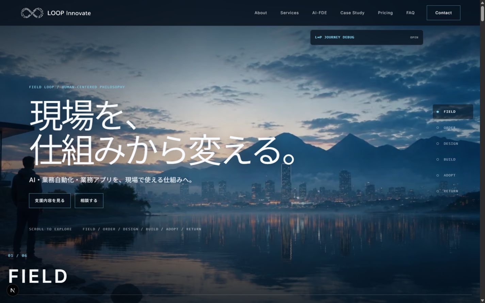
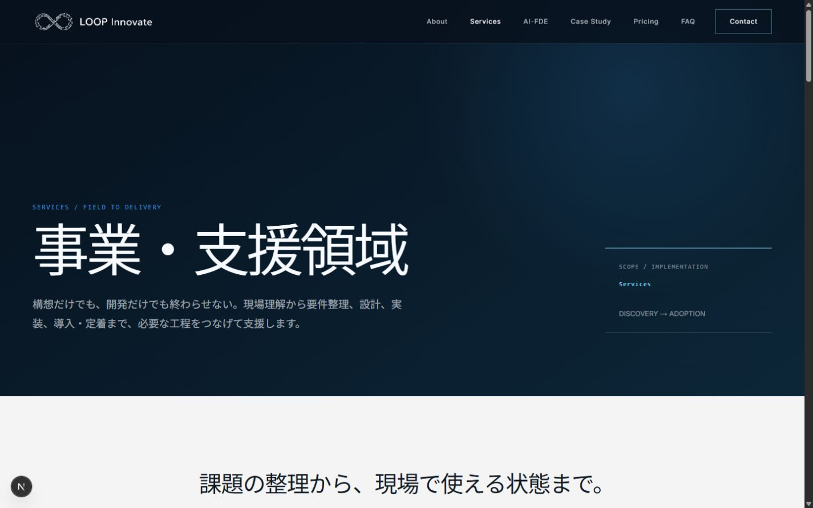
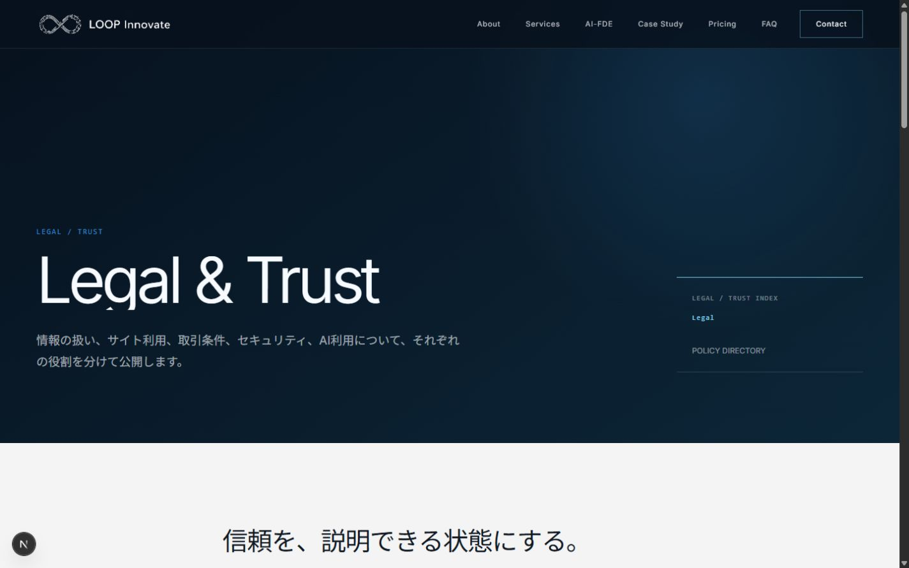

# L∞P Innovate Corporate Site

> **Status: Work in Progress / 開発中**  
> 本リポジトリは、完成品の展示ではなく、要件整理・設計・AI駆動開発・実装・検証・改善のプロセスを伝えるためのポートフォリオです。

FIELD LOOPの6シーンと、事業内容・相談導線を同じファーストビューで伝えるHero Experienceです。



## プロジェクト概要

「未来創造工房 L∞P Innovate」のコーポレートサイトを、WordPressベースの既存サイトから独自設計のNext.jsサイトへ再構築しています。

AIコンサルティング、AI導入支援、業務改善、AIアプリ開発などの支援内容を、機能説明だけでなく「現場の課題を整理し、仕組みとして定着させる」という考え方とともに伝えることを目指しています。

## 開発目的

- ブランドの思想とサービス内容が一貫して伝わる情報設計
- スクロール体験を使った、静的な会社案内とは異なるHero Experience
- デスクトップ、タブレット、モバイルを横断するレスポンシブ設計
- Reduced Motionやキーボード操作を含むアクセシビリティへの配慮
- コンテンツ、モーション、アセット、法務情報を分離した保守しやすい構成
- テストとフォールバックを前提にした、段階的に改善できる開発基盤

## 主な実装内容

- **FIELD LOOP Hero Experience** — 6つのシーンをスクロール進行に対応させたScrollytelling
- **レスポンシブUI** — Wide / Desktop / Tablet / Compact / Narrowを意識したレイアウト
- **モーション設計** — スクロール連動、シーン遷移、レイヤー表現、Reduced Motion対応
- **コーポレートページ** — About / Services / AI-FDE / Case Study / Pricing / FAQ / Contact
- **Trust & Legal** — Security / AI Policy / Privacy Policy / Terms / Legal hub。特商法表記は確認済み事実が揃うまで公開導線から除外
- **UIコンポーネント設計** — Header、Footer、Route Page、Hero、Corporate Sectionsを責務別に分離
- **メディアフォールバック** — 画像・動画が未確定または取得できない場合も破綻させない構成
- **SEO基盤** — Metadata、robots、sitemap、canonical、favicon、OGP、Organization schemaの公開制御
- **品質確認** — ESLint、TypeScript、Node.js標準テスト、production build、ブラウザーQA
- **開発用診断** — productionには露出しないJourney Debugとアセット検証

## 自分の担当範囲

このプロジェクトでは、次の範囲を一貫して担当しています。

- 要件整理と優先順位付け
- 情報設計、ページ構成、ユーザー導線
- UI/UX方針とブランド表現
- 技術選定と実装方針の決定
- AIへの実装指示、タスク分解、受け入れ条件の定義
- 出力コードと画面のレビュー
- 不具合修正、リファクタリング、段階的な改善
- テスト設計、ブラウザーQA、品質確認
- 法務・セキュリティ情報について、未確認事項を推測で公開しないための制御

## AI駆動開発について

CodexとClaude Codeを開発支援として活用しています。用途は単なるコード生成ではなく、次の開発サイクル全体です。

```text
要件整理
  → タスク分解・受け入れ条件
  → AIへの実装指示
  → コード／画面レビュー
  → 修正・改善
  → 自動テスト／ブラウザーQA
  → 次の課題整理
```

設計判断、公開する情報、品質基準、最終的な採否は人が担い、AIの出力は必ず確認・修正する前提で進めています。プロジェクト内の設計資料やテストも、判断過程を後から追えるように残しています。

## 技術スタック

| 分類 | 使用技術 | 用途 |
| --- | --- | --- |
| Framework | Next.js 16.3.3 | App Router、SSG、Metadata、画像最適化 |
| UI | React 19.2.8 | コンポーネント設計、状態管理 |
| Language | TypeScript 5.9.3 | 型安全なページ、設定、Timeline |
| Styling | CSS Modules / CSS Custom Properties | レスポンシブ、モーション、デザイントークン |
| Typography | Noto Sans JP / Inter via `next/font` | 自己ホストWeb Font、Windows表示の安定化 |
| Runtime | Node.js 24+ / npm | 開発、検証、production build |
| Quality | ESLint / jsx-a11y / Node.js Test Runner | 静的解析、アクセシビリティ規則、単体テスト |
| Version Control | Git / GitHub | 変更管理。Publicリポジトリとして公開中 |

Cloudflareは本番デプロイ候補ですが、現時点のリポジトリにはデプロイ設定を含めていません。実際に統合した段階で技術スタックへ追加します。

## スクリーンショット

Hero ExperienceはREADME冒頭に掲載しています。以下は主要な下層ページです。

### Services

現場理解から要件整理、設計、実装、導入・定着までを支援範囲として示すページです。



### Legal & Trust

Privacy、Terms、Security、AI Policyを役割別に案内し、未確定情報を公開しないTrust hubです。



## 現在の開発状況

| 状態 | 内容 |
| --- | --- |
| 完了済み | Next.js基盤、主要ルート、510svhの6シーンHero、レスポンシブ設計、Reduced Motion、法務・信頼ページ、Footer、Web Font、SEO/OGP/schema制御、67件の自動テスト |
| 実装・調整中 | 実機を含む最終QA、公開用Contact情報、料金・法務情報の運営者確認 |
| 今後対応予定 | WordPress Contact実装、確定法務情報、本番ドメインとindexing設定、WordPressテーマ方式の比較・移行 |

## セットアップ

### 必要環境

- Node.js 24以上
- npm

### ローカル起動

```bash
git clone <repository-url>
cd loop-innovate-corporate-site
npm ci
npm run dev
```

ブラウザーで `http://localhost:3000` を開きます。通常のローカル確認にAPIキーや秘密情報は不要です。

### 環境変数

`.env.example`には変数名と安全な初期値だけを記載しています。実値を設定する場合は`.env.local`を使用し、Gitへ追加しないでください。

```bash
NEXT_PUBLIC_JOURNEY_DEBUG=false
NEXT_PUBLIC_SITE_URL=
NEXT_PUBLIC_SITE_INDEXING=false
NEXT_PUBLIC_CONTACT_READY=false
FFPROBE_PATH=
```

### 品質確認

```bash
npm run lint
npm run typecheck
npm test
npm run asset:check
npm run build
```

2026年8月時点で、lint、型検査、67件のテスト、production buildを品質Gateとして運用しています。

## ディレクトリ構成

```text
app/                         Next.js App Router、ページ、Metadata
components/site/             共通UI、コーポレートページ、モーション
components/scrollytelling/   FIELD LOOP Journey
components/experiments/      開発・回帰確認用の隔離された実験
lib/site/                    ナビゲーション、ページ本文、法務情報、SEO
lib/scrollytelling/          Scene設定、Timeline、アセット解決
styles/                      デザイントークン
public/                      公開用のブランド／画像／動画アセット
assets/source/               採用済みアセットの制作元データ
docs/                        設計判断、アクセシビリティ、ロードマップ
skills/                      プロジェクト固有のAI開発ガイド
tests/                       Timeline、アセット、UI契約の自動テスト
```

## 今後の予定

1. 動画とスクロールモーションの最終調整
2. モバイル実機を含むレスポンシブ最適化
3. コピー、料金、実績、法務情報の最終承認
4. Lighthouse等を用いたパフォーマンス／アクセシビリティ確認
5. Cloudflareを候補とした本番デプロイ
6. WordPressとの連携、または非エンジニア向け編集導線の検討

## WordPress移行前の設計資料

- [Font audit](docs/font-audit.md)
- [Motion audit](docs/motion-audit.md)
- [Brand naming rule](docs/brand-naming.md)
- [Case Study content model](docs/content-models/case-study.md)
- [WordPress migration architecture](docs/wordpress-migration-architecture.md)
- [Production readiness](docs/production-readiness.md)

## 注意事項

- 本リポジトリは、ポートフォリオおよび開発プロセスの紹介を目的としてPublicで公開しています。
- 現在開発中のため、仕様、デザイン、コンテンツ、アセットは変更される可能性があります。
- 実績、数値、顧客情報、法務情報は、公開許可や事実確認が取れたものだけを掲載します。
- 本番サイトへのデプロイや既存WordPressサイトの変更は、このリポジトリの公開とは別の承認プロセスで行います。
- 本リポジトリには現時点でオープンソースライセンスを設定していません。
